# 5G-all-in-one-helm documentation

Welcome to the **5G-all-in-one-helm** documentation main page!

## Prerequisites

Before going to use our Helm charts, you have to:

### Create a Kubernetes cluster
The are many solutions for the creation of a Kubernetes cluster. Feel free to visit this [page](https://kubernetes.io/fr/docs/setup/pick-right-solution/) to discover a part of these solutions.
We recommend using [Kubespray](https://github.com/kubernetes-sigs/kubespray) and the Calico network plugin. To enable UPF IP forwarding, change calico_allow_ip_forwarding to true in this [config](https://github.com/kubernetes-sigs/kubespray/blob/master/roles/network_plugin/calico/defaults/main.yml). And enable HELM changing helm_enabled to true in this [config](https://github.com/kubernetes-sigs/kubespray/blob/master/inventory/sample/group_vars/k8s_cluster/addons.yml).
If you don't dispose yet of a Kubernetes cluster, we recommend you to use [Kubeadm](https://kubernetes.io/docs/setup/production-environment/tools/kubeadm/create-cluster-kubeadm/) regarding to its simplicity.

### Install Helm
You have to install a Helm client on a host that can communicate with your Kubernetes API server. 
```console
curl -fsSL -o get_helm.sh https://raw.githubusercontent.com/helm/helm/master/scripts/get-helm-3
chmod 700 get_helm.sh
./get_helm.sh
```
Refer to this [link](https://helm.sh/docs/intro/install/) to view all possible installation methods.

### By cloning the project
1. Clone the project and then.
2. Go to the charts folder `charts`.
```console
git clone https://github.com/zanattabruno/5G-all-in-one-helm.git
```
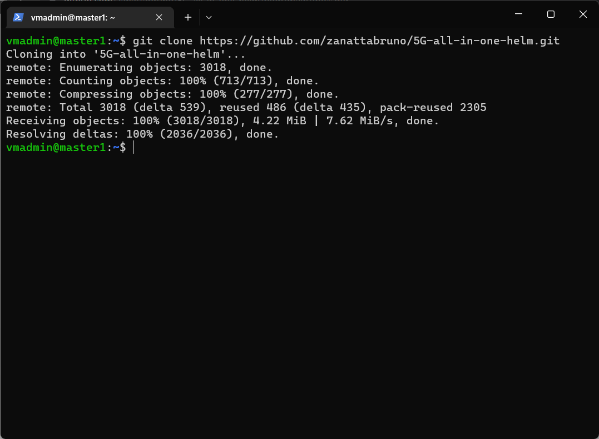


## Basic deployment

### Prerequisites
 - A Kubernetes cluster supporting SCTP
 - Kubernetes worker nodes with kernel 5.0.0-23-generic and containing gtp5g kernel module ([required for the Free5GC UPF element](https://github.com/free5gc/free5gc/wiki/Installation#a-prerequisites)).
 - [Helm3](https://helm.sh/docs/intro/install/).
 - A Persistent Volume (size 8Gi). If are using kubespray with [local-path](https://github.com/kubernetes-sigs/kubespray/blob/master/inventory/sample/group_vars/k8s_cluster/addons.yml#:~:text=local_path_provisioner_enabled%3A%20false) enabled, this step is optional.
 - [Kubectl](https://kubernetes.io/docs/tasks/tools/install-kubectl/) (optional).

### Steps

#### Install gtp5g kernel module
First check that the Linux kernel version on Kubernetes worker nodes is `5.0.0-23-generic` or `5.4.x`. 
```console
uname -r
```

Then, on each worker node, install the [gtp5g kernel module](https://github.com/free5gc/gtp5g). 
```console
git clone -b v0.6.6 https://github.com/free5gc/gtp5g.git
cd gtp5g
make
sudo make install
```
#### Create a Persistent Volume
If you don't have a Persistent Volume provisioner, you can use the following commands to create a namespace for the project and a [Persistent Volume](https://kubernetes.io/docs/concepts/storage/persistent-volumes/) within this namespace that will be consumed by MongoDB by adapting it to your implementation (you have to replace `worker1` by the name of the node and `/home/vagrant/kubedata` by the right directory on this node in which you want to persist the MongoDB data). This is created automatically if you are using local-path provisioning or something similar.

```console
kubectl create ns <namespace>
cat <<EOF | kubectl apply -f -
apiVersion: v1
kind: PersistentVolume
metadata:
  name: example-local-pv9
  labels:
    project: free5gc
spec:
  capacity:
    storage: 8Gi
  accessModes:
  - ReadWriteOnce
  persistentVolumeReclaimPolicy: Retain
  local:
    path: /home/vagrant/kubedata
  nodeAffinity:
    required:
      nodeSelectorTerms:
      - matchExpressions:
        - key: kubernetes.io/hostname
          operator: In
          values:
          - worker1
EOF
```
**NOTE:** you must create the folder on the right node before creating the Peristent Volume.

#### Deploy Free5GC
##### Install the Free5GC Helm chart
On the [charts](../../charts) directory, run:
```console
helm -n <namespace> install <free5GC-helm-release-name> ./free5gc/
```


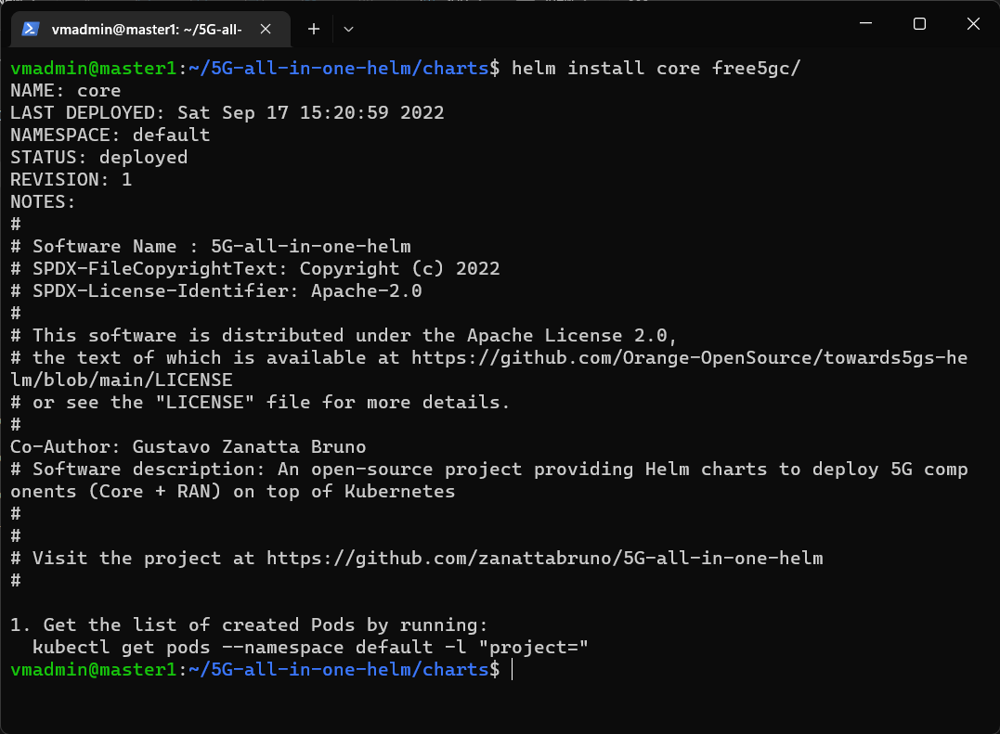

##### Observation

If you are going to use a release name other than core, you have to change the following parameters in SMF:
- [nodeID](charts/free5gc/charts/free5gc-smf/values.yaml#:~:text=nodeID%3A-,core,-%2Dfree5gc%2Dupf%2Dupf) and [endpoints](charts/free5gc/charts/free5gc-smf/values.yaml#:~:text=%2D-,core,-%2Dfree5gc%2Dupf%2Dupf): Where is core put your release name; Example: If your release name is free5gc change core-free5gc-upf-upf-0.upf-service to free5gc-free5gc-upf-upf-0.upf-service.

##### Check the state of the created pods
```console
kubectl -n <namespace> get pods -l "project=free5gc"
```
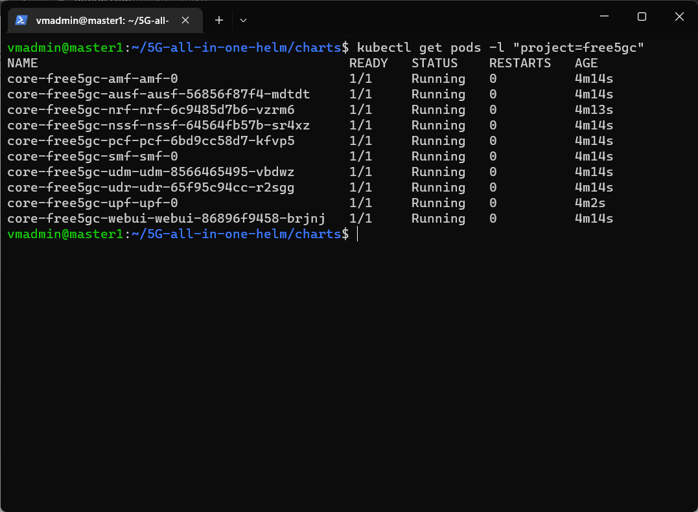

##### Add user information
The WEBUI can is exposed with a Kubernetes service with `nodePort=30500`. So you can access it by using this url `{replace-by-the-IP-of-one-of-your-cluster-nodes}:30500`.

For adding a new subscriber, please refer to the [Free5GC documentation](https://github.com/free5gc/free5gc/wiki/New-Subscriber-via-webconsole#4-use-browser-to-connect-to-webconsole). Initially, UE is configured with Free5GC default values.

Default **user** is *admin* and **password** is *free5gc*:
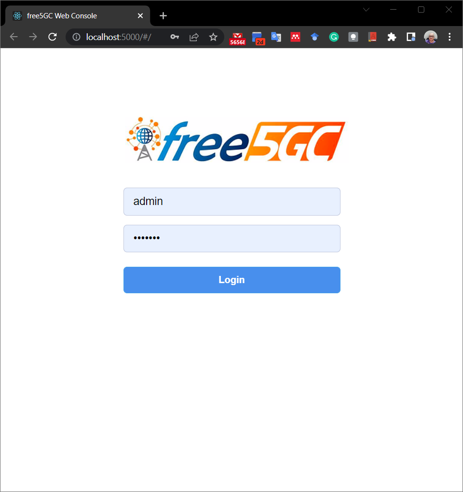

Go to Menu Sunscribers > New Subscriber > Submit (With defaults values)

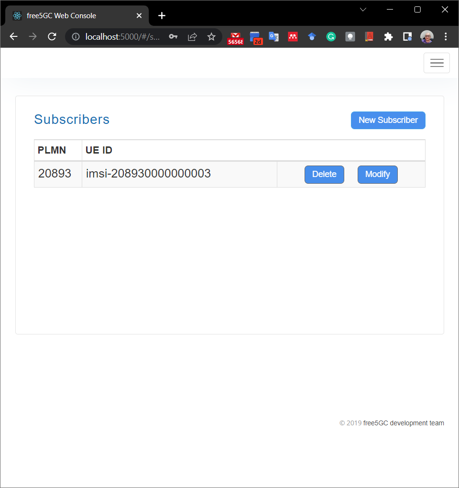

#### RAN deployment

You can choose between two RAN open source projects to deploy 
[UERANSIM](https://github.com/aligungr/UERANSIM) or [my5G-RANTester](https://github.com/my5G/my5G-RANTester).


##### Deploy of UERAMSIM 
###### Install the UERANSIM Helm chart
On the [charts](../../charts) directory, run:
```console
helm -n <namespace> install <UERANSIM-release-name> ./ueransim/
```
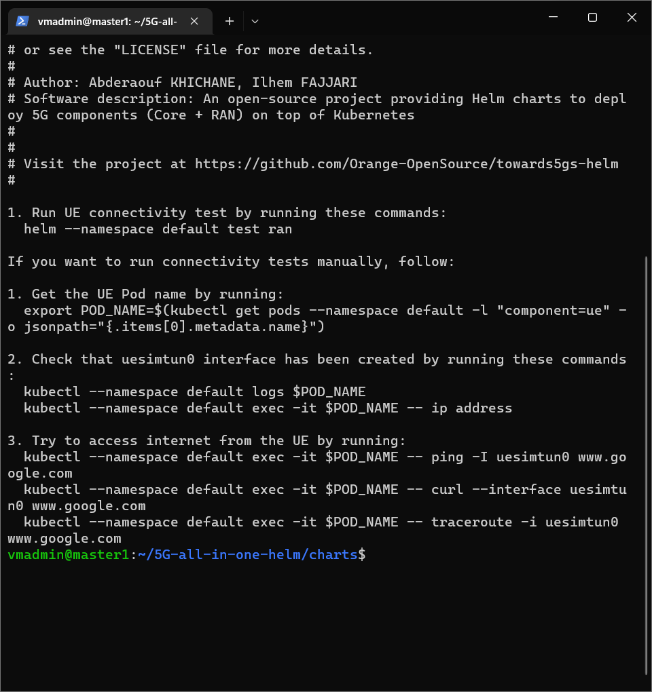

###### Check the state of the created pods
```console
kubectl -n <namespace> get pods -l "app=ueransim"
```
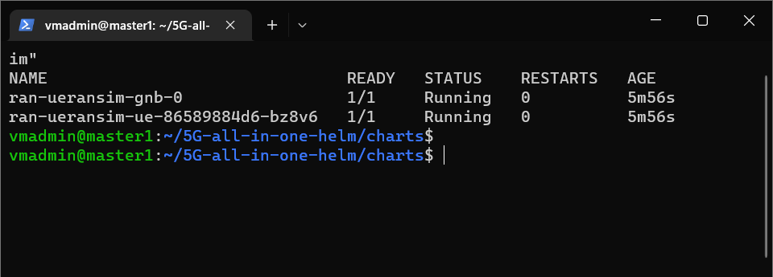

###### Test with the TUN interface
Once the UERANSIM components created, you can access to the UE pod by running:
```console
kubectl -n <namespace> exec -it <ue-pod-name> -- bash
```
Then, you can use the created TUN interface for more advanced testing. Please refer to the UERANSIM helm chart's [README](../../charts/ueransim) and check this [link](https://github.com/aligungr/UERANSIM/wiki/)  and the [UERANSIM chart Readme](/charts/ueransim) for more details.
```console
# Run this inside the container
ip address 
...
5: uesimtun0: <POINTOPOINT,MULTICAST,NOARP,UP,LOWER_UP> mtu 1500 qdisc fq_codel state UNKNOWN group default qlen 500
    link/none 
    inet 10.1.0.1/32 scope global uesimtun0
       valid_lft forever preferred_lft forever

ping -I uesimtun0 www.google.com
traceroute -i uesimtun0 www.google.com
curl --interface uesimtun0 www.google.com
```

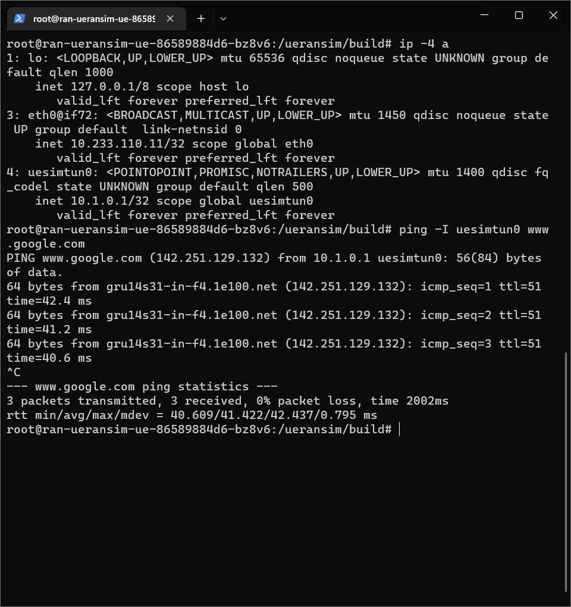
##### Deploy of my5G-RANTester 

First uninstall UERAMSIM or change subscriber ID.

###### Apply my5G-RANTeste Helm chart
On the [charts](../../charts) directory, run:
```console
helm -n <namespace> install <UERANSIM-release-name> rantester/
```
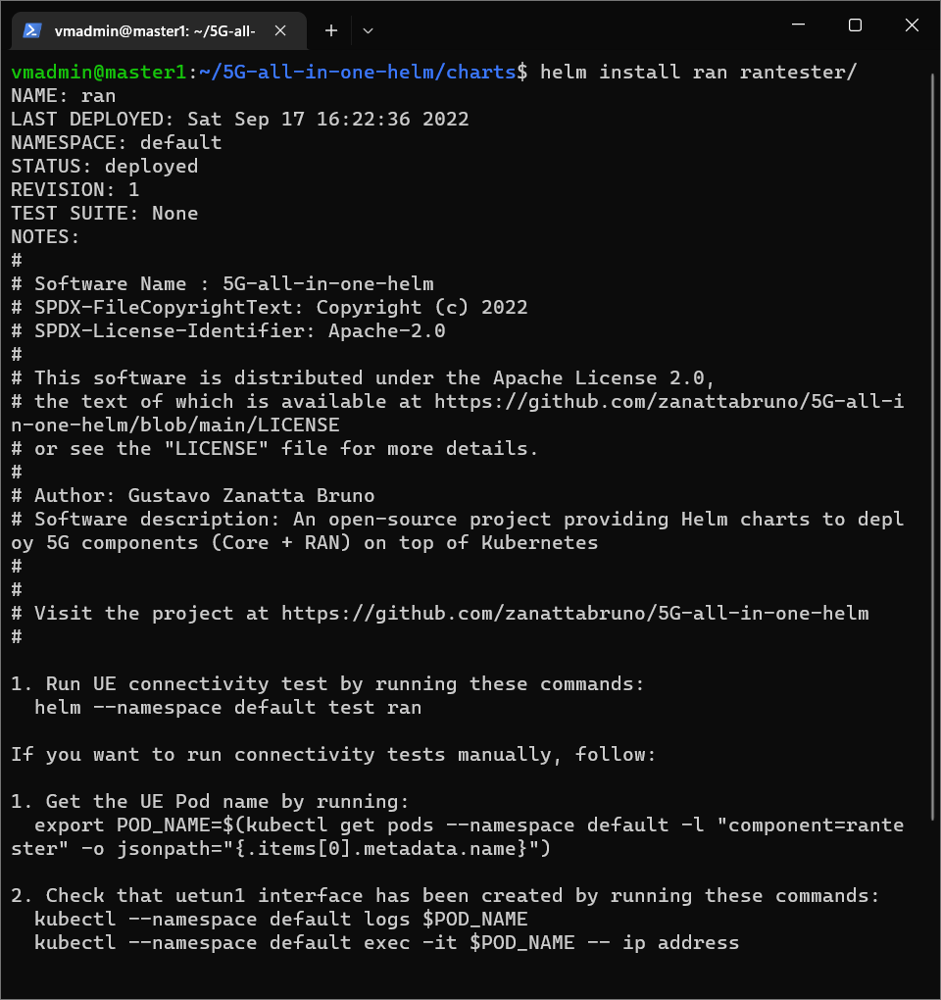
###### Check the state of the created pods
```console
kubectl -n <namespace> get pods -l "app=rantester"
```
###### Test with the TUN interface
Once the RANTester components created, you can access to the UE pod by running:
```console
kubectl -n <namespace> exec -it <ue-pod-name> -- bash
```
Then, you can use the created TUN interface for more advanced testing. check this [link](hhttps://github.com/my5G/my5G-RANTester) for more details.
```console
# Run this inside the container
ip address 
...
5: uetun1: <POINTOPOINT,MULTICAST,NOARP,UP,LOWER_UP> mtu 1500 qdisc fq_codel state UNKNOWN group default qlen 500
    link/none 
    inet 10.1.0.1/32 scope global uetun1
       valid_lft forever preferred_lft forever

ping -I uetun1 www.google.com
traceroute -i uetun1 www.google.com
curl --interface uetun1 www.google.com
```

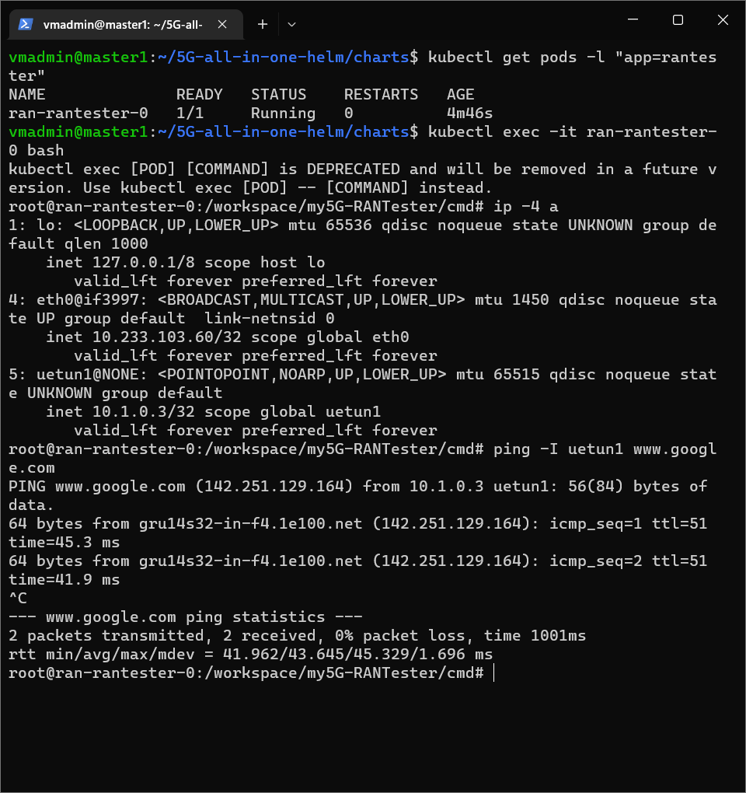

## Monitoring GTP tunnel throughput (UE - UPF) with Prometheus:

Add prometheus helm repo:
```console
helm repo add prometheus-community https://prometheus-community.github.io/helm-charts
helm repo update
```

Create namespace for monitoring stack:
```console
kubectl create namespace monitorng
```

Install prometheus monitoring stack:
```console
helm install primetheus stack prometheus-community/kube-prometheus-stack
```

Describe UPF POD to verify pod location
```console
kubectl describe pod core-free5gc-upf-upf-0 | grep Node:
```
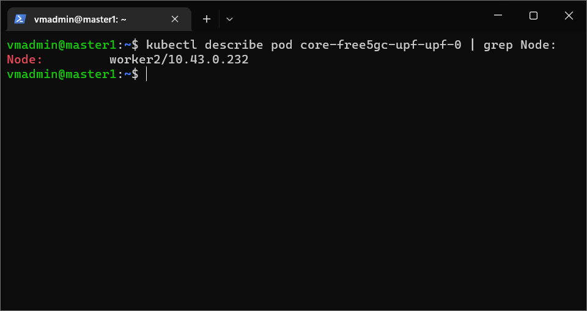

Connect by ssh in node where UPF is running and start iperf in server node:
```console
ssh <user>@<UPF-node>
iperf -s
```
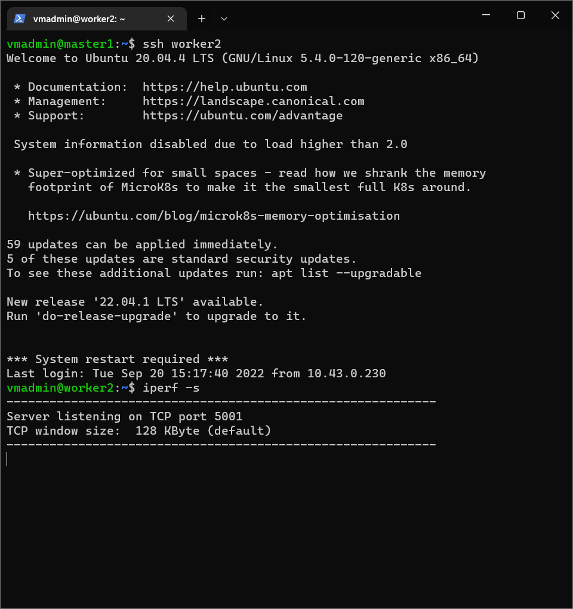

In a new terminal instance (Iperf server must be running), go back to cluster administration node and connect to RAN pod, in this case RANTester pod. Start IPerf in client mode using interface created by RANTester
```console
kubectl exec -it ran-rantester-0 bash
iiperf -B <RANTester-interface> -c <UPF-node> -i 1 -n 600
```

By end in a new terminal forward grafana pod port to access in your desktop:
```console
kubectl port-forward <grafana-pod-name> -n monitoring 3000:grafana
```
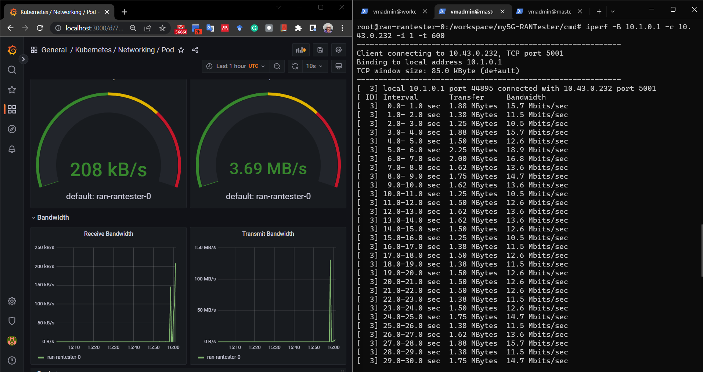

### Troubleshooting
#### Clean MongoDB
According to the [Free5GC documentation](https://github.com/free5gc/free5gc/wiki), you may sometimes need to drop the data stored in the MongoDB. To do so with our implementation, you need simply to empty the folder that was used in the Persistent Volume on the corresponding node.
```console
sudo rm -rf {path-to-folder}/*
```

Or, if are using local-path

```console
kubectl get pvc
kubectl delete pvc datadir-mongodb-0
```
And reinstall core and RAN helms.

#### TUN interface correctly created on the UE but internet 
This may occur because of `ipv4.ip_forward` being disabled on the UPF POD. In fact, this functionalty is needed by the UPF as it allows him to [act as a router](http://linux-ip.net/html/routing-forwarding.html).

To check if it is enabled, run this command on the UPF POD. The result must be 1.
```console
cat /proc/sys/net/ipv4/ip_forward
```
We remind you that some CNI plugins (e.g. [Flannel](https://github.com/flannel-io/flannel)) allow this functionality by default, while others (.e.g. [Calico](https://github.com/projectcalico/cni-plugin)) require a [special configuration](https://docs.projectcalico.org/reference/host-endpoints/forwarded).

### Reference
 - https://github.com/free5gc/free5gc/wiki
 - https://github.com/free5gc/free5gc-compose
 - https://github.com/aligungr/UERANSIM/wiki/Usage#using-the-tun-interface
 - https://docs.projectcalico.org/about/about-calico
 - https://github.com/Orange-OpenSource/towards5gs-helm
 - https://github.com/my5G/my5G-RANTester

